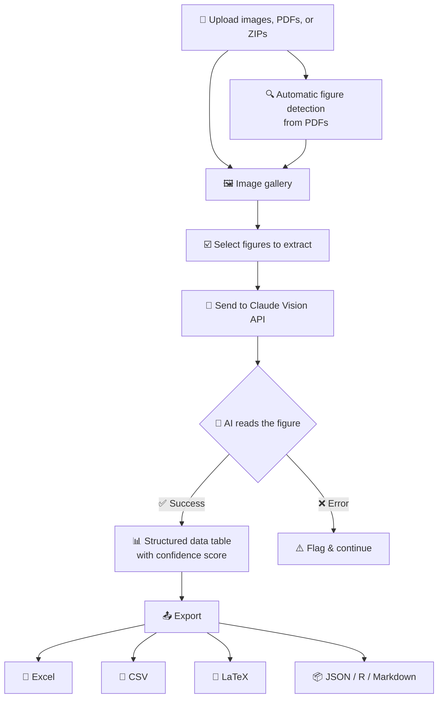

# PlotPick

AI-powered extraction of numerical data from scientific figures.

Upload images, PDFs, or ZIP archives. Each figure is sent to Claude's
vision API with a structured extraction prompt. Results are displayed
as tables and can be exported in multiple formats.

## Features

- **PDF figure detection** -- automatically finds and crops individual
  figures and tables from multi-page PDFs using caption detection
- **Batch processing** -- upload multiple files at once
- **Structured extraction** -- reads boxplots, bar charts, and line plots
  with biomarker, group, timepoint, and summary statistics
- **Export formats** -- Markdown, Excel, CSV, JSON

## Architecture



## Quickstart

1. Install dependencies:

   ```
   pip install -r requirements.txt
   ```

2. Add your Anthropic API key to `.streamlit/secrets.toml`:

   ```toml
   ANTHROPIC_API_KEY = "sk-ant-..."
   ```

3. Run the app:

   ```
   streamlit run streamlit_app.py
   ```

## Requirements

- Python 3.12+
- An [Anthropic API key](https://console.anthropic.com/)
