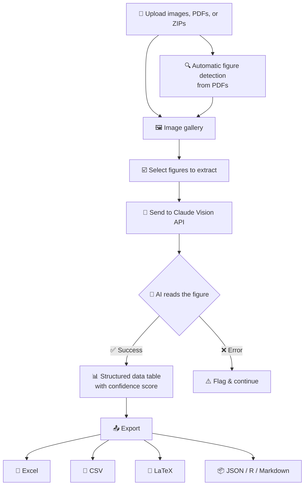

# PlotPick

AI-powered extraction of numerical data from scientific figures.

Upload images, PDFs, or ZIP archives. Each figure is sent to Claude's
vision API with a structured extraction prompt. Results are displayed
as tables and can be exported in multiple formats.

## Features

- **PDF figure detection** -- automatically finds and crops individual
  figures and tables from multi-page PDFs using caption detection
- **Batch processing** -- upload multiple files at once
- **Structured extraction** -- reads boxplots, bar charts, and line plots
  with biomarker, group, timepoint, and summary statistics
- **Export formats** -- Markdown, Excel, CSV, JSON

## Architecture



## Quickstart

1. Install dependencies:

   ```
   pip install -r requirements.txt
   ```

2. Add your Anthropic API key to `.streamlit/secrets.toml`:

   ```toml
   ANTHROPIC_API_KEY = "sk-ant-..."
   ```

3. Run the app:

   ```
   streamlit run streamlit_app.py
   ```

## Validation dataset

The `validation/` folder contains scripts to build a ground-truth dataset
for benchmarking PlotPick against structured table data from the same papers.

1. **Find candidates** -- query PMC for open-access articles that
   cross-reference a table and a figure presenting the same data:

   ```
   python validation/find_validation_papers.py
   ```

2. **Download PDFs + extract tables** -- fetch the PDF and parse structured
   table data from the PMC XML (ground truth):

   ```
   python validation/download_ground_truth.py [--limit N]
   ```

3. **Match table-figure pairs** -- identify which Table N corresponds to
   Figure M, extract the figure image, and filter for numeric tables:

   ```
   python validation/match_pairs.py [--limit N]
   ```

4. **Run benchmark** -- send each figure through Claude's vision API and
   compare extracted values against ground-truth tables:

   ```
   python validation/run_benchmark.py [--model sonnet|haiku] [--limit N]
   python validation/run_benchmark.py --report   # regenerate report only
   ```

Output:
- `validation/candidates.csv` -- candidate paper metadata
- `validation/pdfs/` -- downloaded PDFs
- `validation/tables/` -- structured table data (JSON, one file per paper)
- `validation/pairs.json` -- matched table-figure pairs (199 pairs)
- `validation/figures/` -- extracted figure PNGs
- `validation/results/` -- per-pair extraction results
- `validation/benchmark_report.md` -- aggregate accuracy metrics

## Requirements

- Python 3.12+
- An [Anthropic API key](https://console.anthropic.com/)
