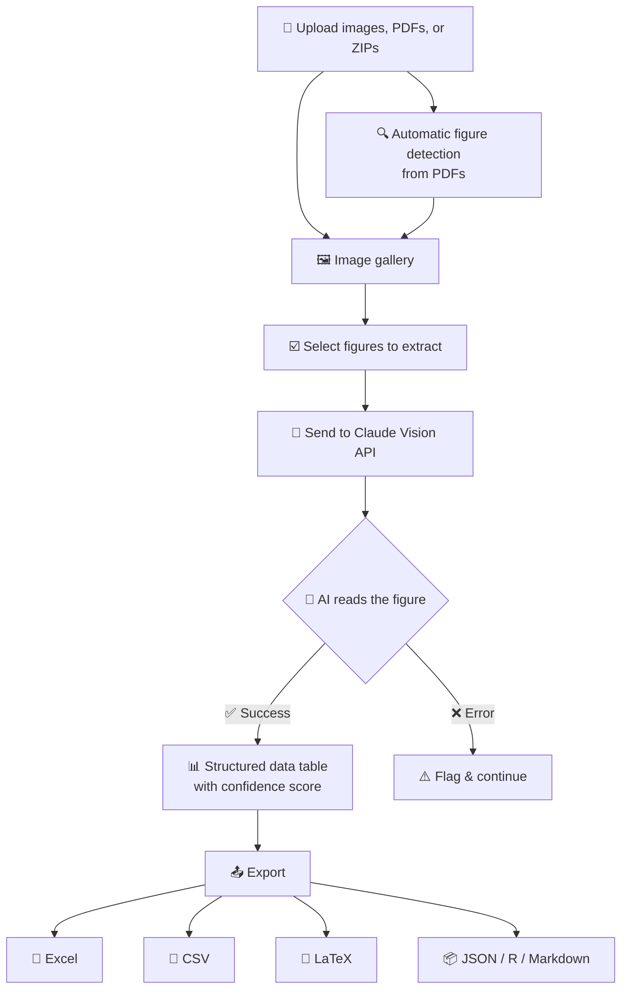

# PlotPick

**Live demo:** [plotpick.streamlit.app](https://plotpick.streamlit.app/)

AI-powered extraction of numerical data from scientific figures.

Upload images, PDFs, or ZIP archives. Each figure is sent to Claude's
vision API with a structured extraction prompt. Results are displayed
as tables and can be exported in multiple formats.

## Features

- **PDF figure detection** -- automatically finds and crops individual
  figures and tables from multi-page PDFs using caption detection
- **Batch processing** -- upload multiple files at once
- **Structured extraction** -- reads boxplots, bar charts, and line plots
  with biomarker, group, timepoint, and summary statistics
- **Export formats** -- Markdown, Excel, CSV, JSON

## Architecture


```mermaid
flowchart TD
    A["📁 Upload images, PDFs, or ZIPs"] --> B["🔍 Automatic figure detection<br/>from PDFs"]
    A --> C["🖼️ Image gallery"]
    B --> C
    C --> D["☑️ Select figures to extract"]
    D --> E["🔑 Send to Claude Vision API"]
    E --> F{"🤖 AI reads the figure"}
    F -->|✅ Success| G["📊 Structured data table<br/>with confidence score"]
    F -->|❌ Error| H["⚠️ Flag & continue"]
    G --> I["📤 Export"]
    I --> J["📗 Excel"]
    I --> K["📄 CSV"]
    I --> L["🔬 LaTeX"]
    I --> M["📦 JSON / R / Markdown"]
```

## Quickstart

1. Install dependencies:

   ```
   pip install -r requirements.txt
   ```

2. Supply an Anthropic API key. Either export it:

   ```
   export ANTHROPIC_API_KEY="sk-ant-..."
   ```

   or write it to `.streamlit/secrets.toml`:

   ```toml
   ANTHROPIC_API_KEY = "sk-ant-..."
   ```

   You can also paste a key straight into the sidebar at runtime, which
   overrides both. Get a key from the
   [Anthropic Console](https://console.anthropic.com/).

3. Run the app:

   ```
   streamlit run streamlit_app.py
   ```

## Models

Pick the model in the sidebar. The first two run on whichever key the app is
configured with; Opus 5 only ever uses a key you paste in yourself.

| Model | Model ID | Key | ChartX mean recall |
|-------|----------|-----|--------------------|
| Sonnet 4.6 (default) | `claude-sonnet-4-6` | app key or your own | 92.2% |
| Haiku 4.5 | `claude-haiku-4-5-20251001` | app key or your own | 88.5% |
| Opus 5 | `claude-opus-5` | your own key only | not benchmarked |

Recall is the mean over 299 paired figures from the ChartX validation split.
Sonnet 4.6 is the default because it beats Haiku 4.5 by 3.7 points
(95% CI [2.7, 4.8]), a gap that holds across all six chart types; Haiku 4.5
is the cheaper and faster option where that gap is acceptable.

## Troubleshooting

**The "Extract all" / "Extract selected" buttons are greyed out.**
Almost always a missing API key -- the buttons stay disabled until one is
available, and the sidebar says which of these is missing. Check, in order:

1. An API key is set (see step 2 above). Selecting Opus 5 ignores the app's
   key by design, so it needs a key pasted into the sidebar.
2. At least one figure is loaded -- upload a file or enter a PubMed ID.
3. For "Extract selected" only, at least one figure is ticked in the gallery.

Hovering a disabled button shows the specific reason.

## Validation dataset

The `validation/` folder contains scripts to build a ground-truth dataset
for benchmarking PlotPick against structured table data from the same papers.

1. **Find candidates** -- query PMC for open-access articles that
   cross-reference a table and a figure presenting the same data:

   ```
   python validation/find_validation_papers.py
   ```

2. **Download PDFs + extract tables** -- fetch the PDF and parse structured
   table data from the PMC XML (ground truth):

   ```
   python validation/download_ground_truth.py [--limit N]
   ```

3. **Match table-figure pairs** -- identify which Table N corresponds to
   Figure M, extract the figure image, and filter for numeric tables:

   ```
   python validation/match_pairs.py [--limit N]
   ```

4. **Run benchmark** -- send each figure through Claude's vision API and
   compare extracted values against ground-truth tables:

   ```
   python validation/run_benchmark.py [--model sonnet|haiku] [--limit N]
   python validation/run_benchmark.py --report   # regenerate report only
   ```

Output:
- `validation/candidates.csv` -- candidate paper metadata
- `validation/pdfs/` -- downloaded PDFs
- `validation/tables/` -- structured table data (JSON, one file per paper)
- `validation/pairs.json` -- matched table-figure pairs (199 pairs)
- `validation/figures/` -- extracted figure PNGs
- `validation/results/` -- per-pair extraction results
- `validation/benchmark_report.md` -- aggregate accuracy metrics

## Requirements

- Python 3.12+
- An [Anthropic API key](https://console.anthropic.com/)
