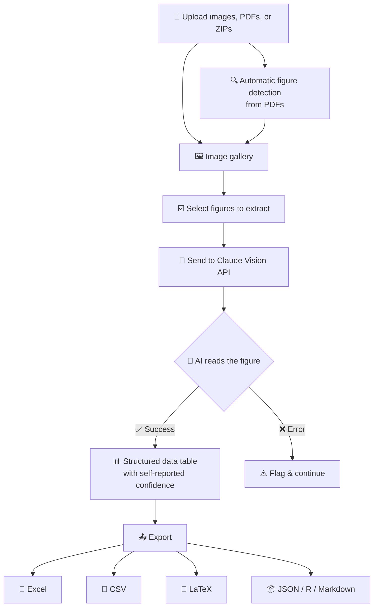

# PlotPick

[](https://github.com/tommycarstensen/plotpick/actions/workflows/test.yml)

**Live demo:** [plotpick.streamlit.app](https://plotpick.streamlit.app/)

AI-powered extraction of numerical data from scientific figures.

PlotPick is for systematic reviewers and meta-analysts who need numbers that a study reports only in a figure. Interactive digitisers take one figure at a time; PlotPick finds the figures and tables in a batch of PDFs and asks a Claude model for a first transcription of each, which you then check against the figure. The companion preprint is [arXiv:2605.06021](https://arxiv.org/abs/2605.06021).

Upload images, PDFs, or ZIP archives, or enter PubMed identifiers. Each figure is sent to Claude's vision API with a structured extraction prompt. Results are displayed as tables beside their figure and can be exported in multiple formats.

## Features

- **PDF figure detection** -- finds the captions of figures and tables in multi-page PDFs and crops each one; a page with no caption it recognises is offered whole
- **Batch processing** -- upload multiple files at once, or fetch open-access articles from PubMed Central
- **Structured extraction** -- reads box plots, bar charts and line plots with biomarker, group, timepoint and summary statistics. Table crops are sent with the same chart prompt; that use has not been tested.
- **Export formats** -- Markdown, Excel, CSV, LaTeX, JSON, R script

## Architecture


```mermaid
flowchart TD
    A["📁 Upload images, PDFs, or ZIPs"] --> B["🔍 Automatic figure detection<br/>from PDFs"]
    A --> C["🖼️ Image gallery"]
    B --> C
    C --> D["☑️ Select figures to extract"]
    D --> E["🔑 Send to Claude Vision API"]
    E --> F{"🤖 AI reads the figure"}
    F -->|✅ Success| G["📊 Structured data table<br/>with self-reported confidence"]
    F -->|❌ Error| H["⚠️ Flag & continue"]
    G --> I["📤 Export"]
    I --> J["📗 Excel"]
    I --> K["📄 CSV"]
    I --> L["🔬 LaTeX"]
    I --> M["📦 JSON / R / Markdown"]
```

## Quickstart

1. With Python 3.12 or later, get the code and install its dependencies:

   ```
   git clone https://github.com/tommycarstensen/plotpick.git && cd plotpick && pip install -r requirements.txt
   ```

2. Supply an Anthropic API key. Either export it:

   ```
   export ANTHROPIC_API_KEY="sk-ant-..."
   ```

   or write it to `.streamlit/secrets.toml` (create the `.streamlit` directory first; git ignores the file):

   ```toml
   ANTHROPIC_API_KEY = "sk-ant-..."
   ```

   On Streamlit Community Cloud, put the same line in the app's Settings -> Secrets. This key pays for Sonnet and Haiku, and visitors using those are never asked for a key. Get a key from the [Anthropic Console](https://console.anthropic.com/).

3. Run the app:

   ```
   streamlit run streamlit_app.py
   ```

Without a key the app still runs: uploads and PubMed fetches are read, and the figures and tables are detected, cropped and shown in the gallery. Only the two Extract buttons need a key, and the sidebar says so.

## Using the library

Everything except the interface is the Python package `plotpick`, which installs on its own with `pip install .` (add `".[app]"` for the interface's dependencies). Finding the figures in a PDF and transcribing them, without Streamlit:

```python
from pathlib import Path

import anthropic

from plotpick.extraction import extract_from_image
from plotpick.figure_images import pdf_to_figures

client = anthropic.Anthropic()  # reads ANTHROPIC_API_KEY
for figure in pdf_to_figures(Path("paper.pdf").read_bytes(), "paper.pdf"):
    result = extract_from_image(client, figure.png, "claude-haiku-4-5-20251001")
    print(figure.label, result["data"])
```

The package's modules are listed in `plotpick/__init__.py`. `plotpick.pmc` reads PubMed identifiers and fetches open-access PDFs, and `plotpick.exports` writes the R, Excel and LaTeX exports.

## Tests

The tests need no API key: the Anthropic client and the PubMed Central service are replaced by fakes. Continuous integration runs them on Python 3.12 and 3.13, with ruff, pycodestyle and pyright:

```
pip install pytest && pytest tests/
```

## Output

The Results tab shows each figure's table beside the image it was read from, with the values the model flagged as uncertain in amber. The Export tab offers Markdown, Excel (one sheet for all rows and one per figure), CSV, LaTeX, JSON and an R script.

- Every exported row starts with `source` (the file, page and caption label), `model`, `extracted_at` (UTC), `figure_type`, `y_axis` and `scale`, followed by the fields the model returned: `biomarker`, `group` and `timepoint`, then `median`, `q1` and `q3` for box plots; `n`, `mean`, `error` and `error_type` for bar charts; and `mean_or_median`, `error` and `error_type` for line plots.
- The JSON export holds each figure's full result: the fields above, the model's `confidence` (0-100) and `notes`, each row's `uncertain` list, `image_sha256` (identifying the crop that was sent), and the error for any figure that failed.
- Extracting a figure again replaces its earlier result.

## Using PlotPick in a systematic review

PlotPick gives a first transcription; it does not replace data extraction by people. Its accuracy on published figures has not been measured, and the confidence score and the amber flags are the model's own and have not been validated.

- Check every value you keep against the article, not only against the crop: a crop can miss part of a figure or table, and a figure whose caption PlotPick did not recognise is not shown at all, so compare the gallery with the article's list of figures.
- Check the group, the timepoint, the error type (SD, SE or CI) and the units as well as the number. The benchmark behind the paper scores numbers only, not whether a value is assigned to the right group.
- Report PlotPick as an automation tool used in data collection, as PRISMA 2020 item 9 asks ([Page et al. 2021](https://doi.org/10.1136/bmj.n71)) and as the position statement of Cochrane, the Campbell Collaboration, JBI and the Collaboration for Environmental Evidence on AI in evidence synthesis describes ([Flemyng et al. 2025](https://doi.org/10.1002/cl2.70074)): name the PlotPick release or commit, the model and the date (both are in every exported row), what it was used for, and how its output was checked.

## Data handling

Each figure you extract is sent as an image to Anthropic's API, on the hosted demo through the operator's key. PlotPick keeps uploads, crops and results in memory for the session only and writes nothing to disk; on the hosted demo they are processed on Streamlit Community Cloud. A key you paste for Opus stays in your session and is not shared with other sessions. Do not upload material you may not send to a third party.

## Hosted demo

[plotpick.streamlit.app](https://plotpick.streamlit.app/) runs PlotPick on Streamlit Community Cloud on the maintainer's API key, for trying PlotPick on a few figures. It has no guarantee of availability; for a review, run PlotPick locally on your own key.

## Models

Pick the model in the sidebar. Sonnet and Haiku run on the key the app is configured with; Opus 5.5 runs only on a key the visitor pastes in, which appears as a key box when Opus is selected.

| Model | Model ID | Key | ChartX numeric F1 | PlotQA best-series numeric F1 |
|-------|----------|-----|-------------------|-------------------|
| Sonnet 5.5 (default) | `claude-sonnet-5-5` | app key | not benchmarked | not benchmarked |
| Haiku 4.5 | `claude-haiku-4-5-20251001` | app key | 88.7% | 70.2% |
| Opus 5.5 | `claude-opus-5-5` | your own key only | not benchmarked | not benchmarked |

Numeric F1 is the F1 between the numbers a model extracts and the numbers in the ground truth, matched within 5%. The ChartX column is six chart types of the ChartX validation split (synthetic charts, 50 per type; one fewer for Haiku 4.5 on plain bar charts). The PlotQA column is a 529-chart subset of PlotQA's test split, mostly horizontal bar charts, scored on the best-matching series of the reply, which is a more lenient score. Both were run on the previous Sonnet, 4.6, which scored 92.2% and 89.0%. Sonnet 5.5 replaces it as the default at a lower per-token price and has not been benchmarked; Haiku 4.5 is the cheaper and faster option, and it scored well below Sonnet 4.6 on the PlotQA subset. See [Benchmarks](#benchmarks) for what these numbers do not cover.

## Troubleshooting

**The "Extract all" / "Extract selected" buttons are greyed out.**
Almost always a missing API key -- the buttons stay disabled until one is
available, and the sidebar says which of these is missing. Check, in order:

1. An API key is configured (see step 2 above). On the hosted demo that means the app's Secrets settings on Streamlit Community Cloud. Selecting Opus 5.5 ignores the app's key by design, so it needs a key pasted into the sidebar.
2. At least one figure is loaded -- upload a file or enter a PubMed ID.
3. For "Extract selected" only, at least one figure is ticked in the gallery.

Hovering a disabled button shows the specific reason.

## Benchmarks

"The paper" below is the companion preprint, [arXiv:2605.06021](https://arxiv.org/abs/2605.06021). The benchmark behind it lives in its own repository, [plotpick-validation](https://github.com/tommycarstensen/plotpick-validation): the runners, the per-item results and the scripts that regenerate every table and figure. Nothing in this repository runs it.

The two figures in the app's Benchmarks panel (`assets/chartx_by_type.png`, `assets/chartx_heatmap.png`) are the paper's Figures 1 and 2, written by `benchmarks/plot_chartx_validation.py --out-dir <this repo>/assets` in that repository.

What the benchmark does and does not show:

- It scores nine vision-language models and DePlot, a dedicated chart-to-table model, on six chart types of the ChartX validation split (synthetic charts) and six of the models on a PlotQA subset.
- On ChartX all nine models score above DePlot in aggregate (79.1-96.0% against 74.3%), mostly because of box plots, where DePlot returns one value per box. Pooled over the other five chart types, seven of the nine models keep a lead over DePlot and the two weakest do not; the four strongest lead it on every one of those types.
- On the PlotQA subset (529 charts from the first 1,000 entries of its test split, the ones a scoring error left in, 427 of them horizontal bar charts, scored leniently on the best-matching series of each reply) DePlot scores 87.0%. Two of the six models are level with it or slightly above it (89.2% and 89.0%) and four fall below it (83.2% down to 56.7%). General-purpose models are not uniformly better than DePlot, which was trained on PlotQA's training split.
- It uses a two-sentence prompt, not this app's structured prompt, and it scores the numbers only, not the group, timepoint, error-bar or group-size fields the app returns.
- The app's default model, Sonnet 5.5, and Opus 5.5 were not benchmarked.
- The confidence score and the amber uncertainty flags are the model's own, and whether they pick out the values that are wrong has not been tested.
- An earlier version of the paper and of this README reported higher PlotQA scores and a larger lead over DePlot. Those came from scoring errors, which the paper's section "Changes from version 1" describes.
- Accuracy on real biomedical figures has not been established. Check every extracted value against its figure.

## Requirements

- Python 3.12+
- An [Anthropic API key](https://console.anthropic.com/)

## Support and contributing

Questions and bug reports go to the [issue tracker](https://github.com/tommycarstensen/plotpick/issues); see [CONTRIBUTING.md](CONTRIBUTING.md).

## Citation

Please cite the companion preprint: Carstensen, T. PlotPick: AI-powered batch extraction of numerical data from scientific figures. arXiv:2605.06021, https://doi.org/10.48550/arXiv.2605.06021. [CITATION.cff](CITATION.cff) has the same in machine-readable form, and [CHANGELOG.md](CHANGELOG.md) lists the changes between versions.

## License

MIT; see [LICENSE](LICENSE).
