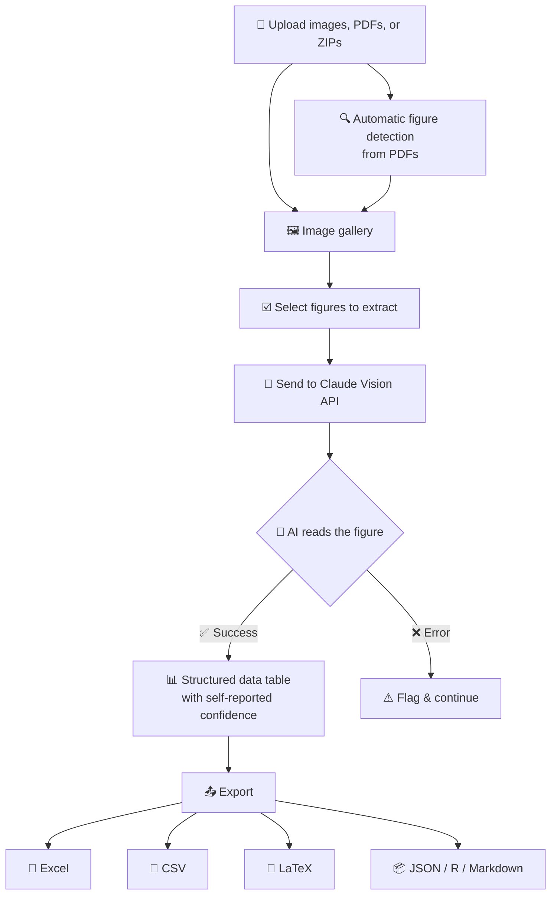

# PlotPick

**Live demo:** [plotpick.streamlit.app](https://plotpick.streamlit.app/)

AI-powered extraction of numerical data from scientific figures.

Upload images, PDFs, or ZIP archives. Each figure is sent to Claude's
vision API with a structured extraction prompt. Results are displayed
as tables and can be exported in multiple formats.

## Features

- **PDF figure detection** -- automatically finds and crops individual
  figures and tables from multi-page PDFs using caption detection
- **Batch processing** -- upload multiple files at once
- **Structured extraction** -- reads boxplots, bar charts, and line plots
  with biomarker, group, timepoint, and summary statistics
- **Export formats** -- Markdown, Excel, CSV, LaTeX, JSON, R script

## Architecture


```mermaid
flowchart TD
    A["📁 Upload images, PDFs, or ZIPs"] --> B["🔍 Automatic figure detection<br/>from PDFs"]
    A --> C["🖼️ Image gallery"]
    B --> C
    C --> D["☑️ Select figures to extract"]
    D --> E["🔑 Send to Claude Vision API"]
    E --> F{"🤖 AI reads the figure"}
    F -->|✅ Success| G["📊 Structured data table<br/>with self-reported confidence"]
    F -->|❌ Error| H["⚠️ Flag & continue"]
    G --> I["📤 Export"]
    I --> J["📗 Excel"]
    I --> K["📄 CSV"]
    I --> L["🔬 LaTeX"]
    I --> M["📦 JSON / R / Markdown"]
```

## Quickstart

1. Install dependencies:

   ```
   pip install -r requirements.txt
   ```

2. Supply an Anthropic API key. Either export it:

   ```
   export ANTHROPIC_API_KEY="sk-ant-..."
   ```

   or write it to `.streamlit/secrets.toml`:

   ```toml
   ANTHROPIC_API_KEY = "sk-ant-..."
   ```

   On Streamlit Community Cloud, put the same line in the app's Settings -> Secrets. This key pays for Sonnet and Haiku, and visitors using those are never asked for a key. Get a key from the [Anthropic Console](https://console.anthropic.com/).

3. Run the app:

   ```
   streamlit run streamlit_app.py
   ```

## Models

Pick the model in the sidebar. Sonnet and Haiku run on the key the app is configured with; Opus 5.5 runs only on a key the visitor pastes in, which appears as a key box when Opus is selected.

| Model | Model ID | Key | ChartX numeric F1 | PlotQA numeric F1 |
|-------|----------|-----|-------------------|-------------------|
| Sonnet 5.5 (default) | `claude-sonnet-5-5` | app key | not benchmarked | not benchmarked |
| Haiku 4.5 | `claude-haiku-4-5-20251001` | app key | 88.7% | 70.2% |
| Opus 5.5 | `claude-opus-5-5` | your own key only | not benchmarked | not benchmarked |

Numeric F1 is the F1 between the numbers a model extracts and the numbers in the ground truth, matched within 5%. The ChartX column is six chart types of the ChartX validation split (synthetic charts, 50 per type). The PlotQA column is a 529-chart subset of PlotQA's test split, mostly horizontal bar charts, scored on the best-matching series of the reply, which is a more lenient score. Both were run on the previous Sonnet, 4.6, which scored 92.2% and 89.0%. Sonnet 5.5 replaces it as the default at a lower per-token price and has not been benchmarked; Haiku 4.5 is the cheaper and faster option, and it scored well below Sonnet 4.6 on the PlotQA subset. See [Benchmarks](#benchmarks) for what these numbers do not cover.

## Troubleshooting

**The "Extract all" / "Extract selected" buttons are greyed out.**
Almost always a missing API key -- the buttons stay disabled until one is
available, and the sidebar says which of these is missing. Check, in order:

1. An API key is configured (see step 2 above). On the hosted demo that means the app's Secrets settings on Streamlit Community Cloud. Selecting Opus 5.5 ignores the app's key by design, so it needs a key pasted into the sidebar.
2. At least one figure is loaded -- upload a file or enter a PubMed ID.
3. For "Extract selected" only, at least one figure is ticked in the gallery.

Hovering a disabled button shows the specific reason.

## Benchmarks

The benchmark behind the paper lives in its own repository, [plotpick-validation](https://github.com/tommycarstensen/plotpick-validation): the runners, the per-item results and the scripts that regenerate every table and figure. Nothing in this repository runs it.

The two figures in the app's Benchmarks panel (`assets/chartx_by_type.png`, `assets/chartx_heatmap.png`) are the paper's Figures 1 and 2, written by `benchmarks/plot_chartx_validation.py --out-dir <this repo>/assets` in that repository.

What the benchmark does and does not show:

- It scores nine vision-language models and DePlot, a dedicated chart-to-table model, on six chart types of the ChartX validation split (synthetic charts) and six of the models on a PlotQA subset.
- On ChartX all nine models score above DePlot in aggregate (79.1-96.0% against 74.3%), mostly because of box plots, where DePlot returns one value per box. On the other five chart types the four strongest models still lead DePlot and the two weakest do not.
- On the PlotQA subset (529 charts from the first 1,000 entries of its test split, the ones a scoring error left in, 427 of them horizontal bar charts, scored leniently on the best-matching series of each reply) DePlot scores 87.0%. Two of the six models are level with it or slightly above it (89.2% and 89.0%) and four fall below it (83.2% down to 56.7%). General-purpose models are not uniformly better than DePlot, which was trained on PlotQA.
- It uses a two-sentence prompt, not this app's structured prompt, and it scores the numbers only, not the group, timepoint, error-bar or group-size fields the app returns.
- The app's default model, Sonnet 5.5, and Opus 5.5 were not benchmarked.
- The confidence score and the amber uncertainty flags are the model's own, and whether they pick out the values that are wrong has not been tested.
- An earlier version of the paper and of this README reported higher PlotQA scores and a larger lead over DePlot. Those came from scoring errors, which the paper's section "Changes from version 1" describes.
- Accuracy on real biomedical figures has not been established. Check every extracted value against its figure.

## Requirements

- Python 3.12+
- An [Anthropic API key](https://console.anthropic.com/)
